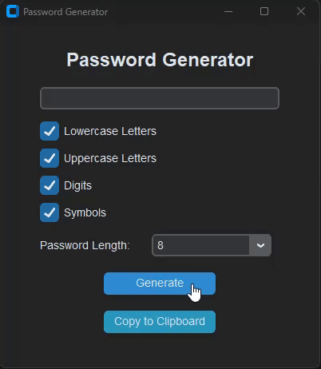

# Password Generator

This is a hands-on project where I used the string and secrets modules. The app allows the user to generate secure passwords based on selected criteria such as lowercase letters, uppercase letters, digits, and symbols, with a flexible password length selection (ranging from 8 to 20).

## Features

- **Character Set Options:**
  - Lowercase letters
  - Uppercase letters
  - Digits
  - Symbols
- **Password Length:** 
  - Select the password length between 8 and 20 characters from a dropdown.
- **Clipboard Functionality:** 
  - Copy the generated password directly to your clipboard with a click.

